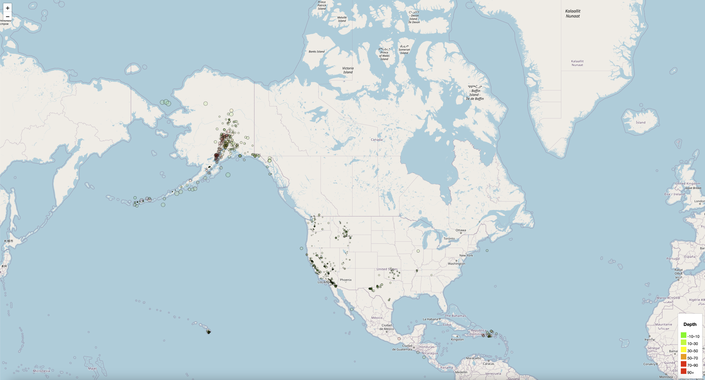
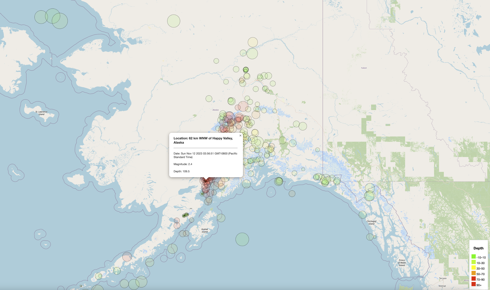

# Leaflet Challenge - Earthquake Visualization
## Background
The United States Geological Survey, or USGS for short, is responsible for providing scientific data about natural hazards, the health of our ecosystems and environment, and the impacts of climate and land-use change. Their scientists develop new methods and tools to supply timely, relevant, and useful information about the Earth and its processes.

The USGS is interested in building a new set of tools that will allow them to visualize their earthquake data. They collect a massive amount of data from all over the world each day, but they lack a meaningful way of displaying it. In this challenge, you have been tasked with developing a way to visualize USGS data that will allow them to better educate the public and other government organizations (and hopefully secure more funding) on issues facing our planet.

### Instructions
The instructions for this activity are broken into two parts:

* Part 1: Create the Earthquake Visualization
* Part 2: Gather and Plot More Data 

### Part 1: Create the Earthquake Visualization
1. First task is to visualize an earthquake dataset. Complete the following steps:  

Get your dataset. To do so, follow these steps:  
* The USGS provides earthquake data in a number of different formats, updated every 5 minutes. Visit the USGS GeoJSON FeedLinks to an external site. page and choose a dataset to visualize.
* When you click a dataset (such as "All Earthquakes from the Past 7 Days"), you will be given a JSON representation of that data. Use the URL of this JSON to pull in the data for the visualization.

2. Import and visualize the data by doing the following:

    * Using Leaflet, create a map that plots all the earthquakes from your dataset based on their longitude and latitude.

    * Your data markers should reflect the magnitude of the earthquake by their size and the depth of the earthquake by color. Earthquakes with higher magnitudes should appear larger, and earthquakes with greater depth should appear darker in color.

    * Include popups that provide additional information about the earthquake when its associated marker is clicked.

    * Create a legend that will provide context for your map data.

## How to Install and Run the script

To run this script:
1. Copy the git link to your local git repository
2. Ensure *Leaflet-Part-1* and *Images* directories are present along with *index.html* file and *static* folder inside *Leaflet-Part-1* folder.
3. The main JS files used to code are in the *static* folder, **logic.js** file has the code for the map depicting earthquakes in the world.
4. Run the index.html file on VScode either using the extension **Liver Server** or double clicking it from the local folder.
5. This ensures the webpage is opened on a new browser tab
6. Once the webpage is loaded, the user has the ability to see several markers indicating the different earthquakes and their magnitudes when you click on the markers.  

## Credits

To write this script, I used the starter code provided and discussed some of the coding hurdles with my TAs and tutor.   

They helped me understand the logic to present the map to depict the earthquakes and associate different colors for different depths to it.  

Majority of the work went into understanding the DOM element in JS. Seeing the dashboard come alive was the most enjoyable part of this challenge. 

